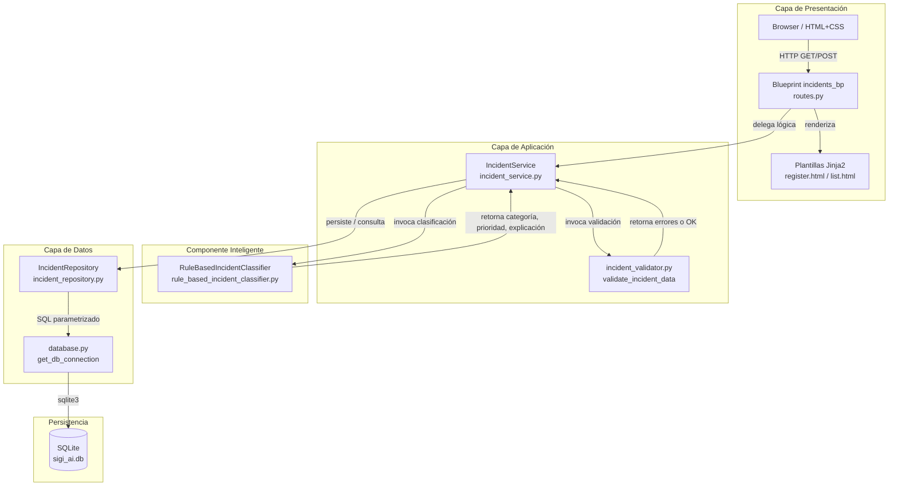
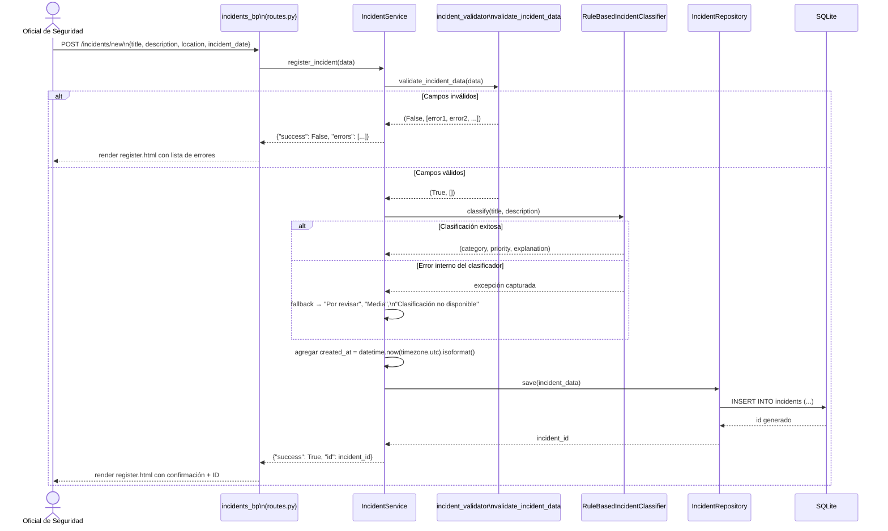
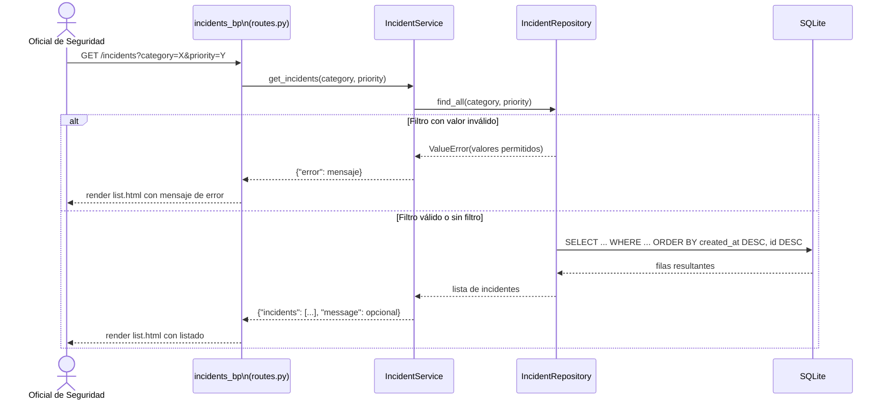

# Design Document

## Overview

SIGI-AI (Sistema Inteligente de Gestión de Incidentes) es una aplicación web monolítica de escritorio local desarrollada con Python y Flask. Su propósito es centralizar el registro, clasificación automática y consulta de incidentes tecnológicos y de seguridad para el Oficial de Seguridad de la Información.

El MVP comprende exactamente tres capacidades funcionales:

1. **Registro estructurado de incidentes** — captura de título, descripción, ubicación/origen y fecha con validación estricta de campos obligatorios.
2. **Clasificación automática** — asignación independiente de categoría y prioridad mediante un sistema experto basado en reglas y palabras clave (`RuleBasedIncidentClassifier`), más una explicación breve del resultado.
3. **Consulta filtrada del historial** — listado de todos los incidentes ordenado descendentemente por fecha de creación e ID, con filtrado opcional por categoría y/o prioridad.

El sistema opera completamente en local, utiliza SQLite como motor de persistencia, Jinja2 para el renderizado de plantillas, y no requiere autenticación ni servicios externos. Toda la interfaz se presenta en español.

---

## Architecture

### Estilo arquitectónico

La aplicación sigue una arquitectura **monolítica modular por capas**, organizada internamente en cuatro capas bien delimitadas: presentación, aplicación, datos e inteligencia. Flask se inicializa mediante el patrón **Application Factory** (`create_app()`), lo que facilita la configuración diferenciada para desarrollo y pruebas.



### Flujo principal: registro y clasificación



### Flujo secundario: consulta con filtros



---

## Components and Interfaces

### 1. Application Factory — `app/__init__.py`

**Responsabilidad:** Inicializar la aplicación Flask, registrar el blueprint `incidents_bp`, aplicar configuración e inicializar la base de datos al arrancar.

**Interfaz pública:**
```
create_app(config_name: str = "default") → Flask
```

**Decisión de diseño:** El uso de Application Factory permite instanciar la app con configuraciones distintas (desarrollo vs. pruebas), evitando estado global compartido entre tests.

---

### 2. Configuración — `app/config.py`

**Responsabilidad:** Centralizar todos los parámetros configurables del sistema.

| Parámetro       | Descripción                                 | Valor por defecto                                    |
|-----------------|---------------------------------------------|------------------------------------------------------|
| `DATABASE_PATH` | Ruta absoluta al archivo SQLite             | `instance/sigi_ai.db`                                |
| `SECRET_KEY`    | Clave para firmar sesiones Flask            | Variable de entorno `SECRET_KEY` o valor de desarrollo |
| `DEBUG`         | Modo de depuración                          | `False` (solo `True` en entorno de desarrollo local) |

---

### 3. Base de datos — `app/database.py` y `app/schema.sql`

**Responsabilidad:** Proveer una función de conexión reutilizable y ejecutar el script de inicialización del esquema al arrancar.

**Interfaz pública:**
```
get_db_connection() → sqlite3.Connection
init_db(app: Flask) → None
```

`get_db_connection()` establece `row_factory = sqlite3.Row` para que las filas sean accesibles por nombre de columna y convertibles a diccionario con `dict(row)`.

`schema.sql` contiene el script `CREATE TABLE IF NOT EXISTS incidents (...)` que se ejecuta una sola vez al inicio de la aplicación.

---

### 4. Blueprint de incidentes — `app/blueprints/incidents/routes.py`

**Responsabilidad:** Definir y exponer las rutas HTTP. Su única responsabilidad es recibir la solicitud HTTP, delegar completamente en `IncidentService` y renderizar la respuesta. No contiene lógica de negocio ni validación de datos.

| Ruta              | Método | Acción                                                          |
|-------------------|--------|-----------------------------------------------------------------|
| `/`               | GET    | Redirección a `/incidents`                                      |
| `/incidents`      | GET    | Delega en `IncidentService.get_incidents()` y renderiza `list.html` |
| `/incidents/new`  | GET    | Renderiza el formulario vacío `register.html`                   |
| `/incidents/new`  | POST   | Delega en `IncidentService.register_incident()` y renderiza resultado |

Parámetros de query en `GET /incidents`: `category` (opcional), `priority` (opcional).

---

### 5. Validador — `app/validators/incident_validator.py`

**Responsabilidad:** Centralizar toda la validación de los datos del formulario de registro. Es el único lugar del sistema donde se validan los campos obligatorios.

**Interfaz pública:**
```
validate_incident_data(data: dict) → tuple[bool, list[str]]
```

**Retorna:** `(True, [])` si todos los campos son válidos; `(False, [msg1, msg2, ...])` con un mensaje por cada campo inválido si alguno falla.

**Reglas de validación:**
- `title`: no vacío y no compuesto solo de espacios en blanco.
- `description`: no vacío y no compuesto solo de espacios en blanco.
- `location`: no vacío y no compuesto solo de espacios en blanco.
- `incident_date`: no vacío, formato `AAAA-MM-DD` verificado con `datetime.strptime(value, "%Y-%m-%d")`.
- Todos los errores se acumulan antes de retornar: si hay tres campos inválidos, se retornan los tres mensajes.

---

### 6. Servicio de aplicación — `app/services/incident_service.py`

**Responsabilidad:** Orquestar el flujo de registro y consulta de incidentes. Coordina el validador, el clasificador y el repositorio. No realiza validación propia ni accede directamente a la base de datos.

**Interfaz pública:**
```
register_incident(data: dict) → dict
    # Retorna: {"success": True, "id": int}
    #       o: {"success": False, "errors": list[str]}

get_incidents(category: str | None, priority: str | None) → dict
    # Retorna: {"incidents": list[dict], "message": str | None}
    #       o: {"error": str}
```

**Flujo de `register_incident(data)`:**
1. Invocar `validate_incident_data(data)`. Si inválido → retornar `{"success": False, "errors": [...]}`.
2. Invocar `RuleBasedIncidentClassifier.classify(title, description)` dentro de un bloque `try/except Exception`.
3. Si se produce una excepción: aplicar fallback (`Por revisar`, `Media`, explicación de fallo de entre 10 y 100 palabras).
4. Agregar `created_at = datetime.now(timezone.utc).isoformat()`.
5. Invocar `IncidentRepository.save(incident_data)`.
6. Retornar `{"success": True, "id": id_generado}`.

**Flujo de `get_incidents(category, priority)`:**
1. Invocar `IncidentRepository.find_all(category, priority)` dentro de un bloque `try/except ValueError`.
2. Si `ValueError`: retornar `{"error": mensaje_descriptivo}`.
3. Si la lista está vacía: retornar `{"incidents": [], "message": "No hay incidentes registrados."}` o `{"incidents": [], "message": "No se encontraron incidentes con los criterios seleccionados."}` según corresponda.
4. Si hay resultados: retornar `{"incidents": lista, "message": None}`.

---

### 7. Clasificador — `app/classifier/rule_based_incident_classifier.py`

**Responsabilidad:** Implementar el sistema experto de clasificación. Determina la **categoría** y la **prioridad** de forma **independiente** mediante dos conjuntos de reglas distintos.

**Interfaz pública:**
```
classify(title: str, description: str) → tuple[str, str, str]
    # Retorna: (category, priority, explanation)
```

#### Normalización de texto

Tanto el texto del incidente como todas las palabras clave de las reglas se normalizan antes de la comparación:
- Conversión a minúsculas.
- Eliminación de acentos y diacríticos mediante `unicodedata.normalize("NFD", text)` filtrando caracteres de categoría `Mn`.
- La normalización se aplica en tiempo de inicialización a las palabras clave de las reglas, y en tiempo de ejecución al texto del incidente.

#### Evaluación de coincidencias

Las palabras clave se evalúan como **palabras completas o frases completas** mediante límites de palabra (`\b`), usando expresiones regulares compiladas. Esto garantiza que, por ejemplo, `"ip"` no coincida dentro de `"equipo"` o `"equipo de cómputo"`.

Cada palabra clave distinta se cuenta **como máximo una vez** por categoría o nivel de prioridad, independientemente de cuántas veces aparezca en el texto.

#### Reglas de categorización — `CATEGORY_RULES`

```
CATEGORY_RULES: dict[str, list[str]] = {
    "Seguridad de la Información": [
        "contrasena", "cifrado", "phishing", "malware",
        "acceso no autorizado", "fuga de datos", "ransomware",
        "vulnerabilidad", "credenciales", "brecha"
    ],
    "Seguridad Física": [
        "acceso fisico", "intrusion", "robo", "camara",
        "vigilancia", "instalacion", "cerradura", "perimetro", "guardia"
    ],
    "Hardware": [
        "disco duro", "memoria ram", "servidor", "impresora",
        "pantalla", "teclado", "fuente de poder", "componente", "dispositivo fisico"
    ],
    "Software": [
        "aplicacion", "error de software", "actualizacion", "parche",
        "instalacion de software", "fallo del sistema", "bug", "crash", "programa"
    ],
    "Red/Conectividad": [
        "red", "internet", "vpn", "firewall", "latencia",
        "ancho de banda", "switch", "router", "conectividad", "ip"
    ],
    "Cuenta/Usuario": [
        "usuario", "cuenta", "bloqueo de cuenta", "acceso denegado",
        "permiso", "rol", "sesion", "autenticacion", "directorio activo"
    ],
}
```

#### Reglas de prioridad — `PRIORITY_RULES`

La prioridad se calcula **de forma independiente** a la categoría, evaluando el mismo texto normalizado contra un segundo conjunto de reglas basadas en riesgo e impacto:

```
PRIORITY_RULES: dict[str, list[str]] = {
    "Alta": [
        "malware", "ransomware", "phishing", "acceso no autorizado",
        "fuga de datos", "intrusion", "robo", "incendio",
        "servicio caido", "interrupcion total", "sistema critico"
    ],
    "Media": [
        "afectacion parcial", "degradacion", "bloqueo", "funcionamiento intermitente",
        "lentitud", "error intermitente", "acceso limitado", "servicio degradado"
    ],
    "Baja": [
        "consulta", "solicitud", "revision menor", "ajuste", "mejora menor",
        "afectacion menor", "informativo"
    ],
}
```

**Regla de resolución de prioridad:**
- Se cuentan coincidencias para cada nivel (`Alta`, `Media`, `Baja`).
- Si no hay coincidencias en ningún nivel → prioridad `Media`.
- Si hay coincidencias en múltiples niveles → se aplica la prioridad de **mayor impacto**: `Alta` > `Media` > `Baja`.

#### Algoritmo completo

```
función classify(title, description):
    texto = normalizar(title + " " + description)

    # Paso 1: determinar categoría
    category_scores = {}
    para cada (categoría, palabras_clave) en CATEGORY_RULES:
        category_scores[categoría] = contar_coincidencias_únicas(texto, palabras_clave)

    max_cat_score = max(category_scores.values())

    si max_cat_score == 0:
        category = "Por revisar"
        priority = "Media"
        explanation = "No se detectaron palabras clave reconocidas. Se requiere revisión manual."
        retornar (category, priority, explanation)

    top_categories = [cat para cat, score en category_scores si score == max_cat_score]

    si len(top_categories) > 1:
        category = "Por revisar"
        priority = "Media"
        explanation = "Ambigüedad entre categorías {top_categories}. Se requiere revisión manual."
        retornar (category, priority, explanation)

    category = top_categories[0]
    matched_keywords = palabras_que_coincidieron(texto, CATEGORY_RULES[category])

    # Paso 2: determinar prioridad de forma independiente
    priority_scores = {}
    para cada (nivel, palabras_clave) en PRIORITY_RULES:
        priority_scores[nivel] = contar_coincidencias_únicas(texto, palabras_clave)

    si priority_scores["Alta"] > 0:
        priority = "Alta"
    sino si priority_scores["Media"] > 0:
        priority = "Media"
    sino si priority_scores["Baja"] > 0:
        priority = "Baja"
    sino:
        priority = "Media"  # sin coincidencias de prioridad

    explanation = generar_explicación(category, priority, matched_keywords)
    retornar (category, priority, explanation)
```

**Generación de explicación:** texto de entre 10 y 100 palabras que menciona la categoría asignada, la prioridad resultante y las palabras clave detectadas. En casos de fallback, el texto describe la razón (sin coincidencias, ambigüedad o error técnico).

---

### 8. Repositorio de datos — `app/repositories/incident_repository.py`

**Responsabilidad:** Encapsular todo el acceso a la base de datos. Usa exclusivamente sentencias SQL parametrizadas con el marcador `?` para prevenir inyección SQL.

**Interfaz pública:**
```
save(incident_data: dict) → int
    # Retorna el ID generado (lastrowid)

find_all(category: str | None, priority: str | None) → list[dict]
    # Lanza ValueError si los valores de filtro no pertenecen al conjunto válido
```

**Lógica de `find_all`:**
1. Si `category` no es `None` y no pertenece al conjunto válido → lanzar `ValueError` con descripción de los valores permitidos.
2. Si `priority` no es `None` y no pertenece al conjunto válido → lanzar `ValueError` con descripción de los valores permitidos.
3. Construir cláusula `WHERE` dinámicamente según los filtros presentes, usando parámetros `?`.
4. Ejecutar `SELECT * FROM incidents ORDER BY created_at DESC, id DESC`.
5. Convertir cada `sqlite3.Row` a `dict(row)` y retornar la lista.

---

## Data Models

### Tabla `incidents` (SQLite)

| Columna                      | Tipo    | Restricción               | Descripción                                                |
|------------------------------|---------|---------------------------|------------------------------------------------------------|
| `id`                         | INTEGER | PRIMARY KEY AUTOINCREMENT | Identificador único generado automáticamente               |
| `title`                      | TEXT    | NOT NULL                  | Título del incidente                                       |
| `description`                | TEXT    | NOT NULL                  | Descripción detallada                                      |
| `location`                   | TEXT    | NOT NULL                  | Ubicación u origen del incidente                           |
| `incident_date`              | TEXT    | NOT NULL                  | Fecha del incidente en formato `AAAA-MM-DD`                |
| `created_at`                 | TEXT    | NOT NULL                  | Timestamp ISO 8601 con zona horaria UTC, generado automáticamente |
| `category`                   | TEXT    | NOT NULL                  | Categoría asignada por el clasificador                     |
| `priority`                   | TEXT    | NOT NULL                  | Prioridad asignada por el clasificador                     |
| `classification_explanation` | TEXT    | NOT NULL                  | Explicación generada por el clasificador (10–100 palabras) |

**Script de creación (`app/schema.sql`):**

```sql
CREATE TABLE IF NOT EXISTS incidents (
    id                         INTEGER PRIMARY KEY AUTOINCREMENT,
    title                      TEXT    NOT NULL,
    description                TEXT    NOT NULL,
    location                   TEXT    NOT NULL,
    incident_date              TEXT    NOT NULL,
    created_at                 TEXT    NOT NULL,
    category                   TEXT    NOT NULL,
    priority                   TEXT    NOT NULL,
    classification_explanation TEXT    NOT NULL
);
```

### Valores válidos de dominio

| Campo      | Conjunto de valores válidos                                                                                               |
|------------|---------------------------------------------------------------------------------------------------------------------------|
| `category` | `Seguridad de la Información`, `Seguridad Física`, `Hardware`, `Software`, `Red/Conectividad`, `Cuenta/Usuario`, `Por revisar` |
| `priority` | `Baja`, `Media`, `Alta`                                                                                                   |

### Representación en Python

Los incidentes se transportan entre capas como diccionarios Python con las claves correspondientes a los nombres de columna de la tabla `incidents`. La conversión de `sqlite3.Row` a `dict` se realiza en el repositorio mediante `dict(row)`.

---

## Project Structure

```
sigi_ai/
├── app/
│   ├── __init__.py                          # Application Factory: create_app()
│   ├── config.py                            # Configuración: DATABASE_PATH, SECRET_KEY, DEBUG
│   ├── database.py                          # get_db_connection(), init_db()
│   ├── schema.sql                           # CREATE TABLE IF NOT EXISTS incidents
│   ├── blueprints/
│   │   └── incidents/
│   │       ├── __init__.py
│   │       └── routes.py                    # Blueprint incidents_bp
│   ├── services/
│   │   └── incident_service.py              # IncidentService
│   ├── validators/
│   │   └── incident_validator.py            # validate_incident_data()
│   ├── classifier/
│   │   └── rule_based_incident_classifier.py  # RuleBasedIncidentClassifier
│   ├── repositories/
│   │   └── incident_repository.py           # IncidentRepository
│   ├── templates/
│   │   ├── base.html                        # Plantilla base con bloques Jinja2
│   │   └── incidents/
│   │       ├── register.html                # Formulario de registro
│   │       └── list.html                    # Listado con filtros
│   └── static/
│       └── css/
│           └── styles.css
├── tests/
│   ├── conftest.py                          # Fixtures compartidos: app de prueba, BD en memoria
│   ├── unit/
│   │   ├── test_validator.py
│   │   ├── test_classifier.py
│   │   ├── test_repository.py
│   │   └── test_service.py
│   └── integration/
│       └── test_routes.py
├── instance/                                # Carpeta de la BD SQLite (excluida del repositorio)
├── run.py                                   # Punto de entrada: app = create_app(); app.run()
├── requirements.txt                         # Flask, pytest
├── .gitignore
└── README.md
```

---

## Correctness Properties

Las siguientes propiedades describen invariantes del sistema que deben mantenerse en todo momento. Se implementan como pruebas Pytest con el patrón AAA (Arrange, Act, Assert).

### Property 1: Todo incidente válido registrado recibe un ID entero positivo
Para cualquier conjunto de campos obligatorios válidos, `register_incident()` debe retornar `{"success": True, "id": N}` donde `N` es un entero positivo. El incidente recuperado desde la BD con ese ID debe contener los mismos datos ingresados.
**Validates: Requirements 1.1, 1.3**

### Property 2: Todo incidente registrado tiene categoría y prioridad del conjunto válido
Para cualquier incidente registrado mediante el servicio, `category` debe pertenecer al conjunto de 7 categorías válidas y `priority` debe pertenecer a `{Baja, Media, Alta}`.
**Validates: Requirements 2.1, 2.2**

### Property 3: Los campos vacíos o solo espacios generan errores de validación
Para cualquier campo obligatorio enviado vacío o compuesto solo de espacios, `validate_incident_data()` debe retornar `(False, errors)` donde `errors` contiene exactamente un mensaje para ese campo.
**Validates: Requirements 1.4, 1.5, 1.6, 1.7, 1.8**

### Property 4: Las fechas con formato incorrecto son rechazadas
Para cualquier cadena que no cumpla el patrón `AAAA-MM-DD`, la validación debe retornar `(False, errors)` con un mensaje que indique el formato requerido.
**Validates: Requirements 1.7**

### Property 5: El clasificador retorna siempre una tupla (categoría, prioridad, explicación) completa
Para cualquier entrada de título y descripción (incluyendo cadenas vacías), `classify()` debe retornar una tupla de exactamente tres elementos no nulos. La categoría y la prioridad deben pertenecer a los conjuntos válidos.
**Validates: Requirements 2.1, 2.2, 2.3, 2.4**

### Property 6: El listado sin filtros está ordenado de más reciente a más antiguo
Para cualquier conjunto de N incidentes almacenados (N ≥ 2), `find_all(None, None)` debe retornar la lista ordenada tal que `created_at[i] ≥ created_at[i+1]` para todo i en `[0, N-2]`. En caso de igualdad en `created_at`, el de mayor `id` aparece primero.
**Validates: Requirements 3.1**

### Property 7: El filtro retorna exclusivamente incidentes que cumplen el criterio
Para cualquier categoría o prioridad válida, todos los incidentes en la lista retornada deben cumplir la condición del filtro aplicado.
**Validates: Requirements 3.2, 3.3, 3.4**

### Property 8: Los filtros inválidos son rechazados con mensaje descriptivo
Para cualquier valor que no pertenezca al conjunto válido de categorías o prioridades, el repositorio debe lanzar `ValueError` y el servicio debe retornar `{"error": mensaje}`.
**Validates: Requirements 3.7**

---

## Error Handling

### Estrategia general

El manejo de errores sigue un principio de **falla localizada y degradación controlada**: los errores de capas internas se capturan, se transforman en mensajes comprensibles en español y se propagan hacia la capa de presentación sin exponer detalles técnicos.

### Errores por capa

#### Capa de presentación (Blueprint `routes.py`)

| Situación                             | Comportamiento                                                               |
|---------------------------------------|------------------------------------------------------------------------------|
| `register_incident` retorna errores   | Re-renderizar `register.html` con la lista de mensajes de error             |
| `get_incidents` retorna `{"error"}` | Re-renderizar `list.html` con mensaje de error y valores válidos             |
| Error HTTP 404                        | Página de error amigable en español, sin traza técnica                       |
| Error HTTP 500                        | Página de error amigable en español, sin traza técnica                       |

#### Capa de aplicación (`IncidentService`)

| Situación                             | Comportamiento                                                               |
|---------------------------------------|------------------------------------------------------------------------------|
| Validación falla                      | Retornar `{"success": False, "errors": [...]}` sin invocar al clasificador   |
| Clasificador lanza excepción          | Capturar con `try/except Exception`, aplicar fallback y continuar el registro |
| Repositorio lanza `ValueError`        | Capturar y retornar `{"error": mensaje_descriptivo}`                         |

**Valores de fallback del clasificador:**
- `category`: `"Por revisar"`
- `priority`: `"Media"`
- `classification_explanation`: texto de 10 a 100 palabras indicando que la clasificación automática no estuvo disponible y se requiere revisión manual del Oficial de Seguridad.

#### Capa de datos (`IncidentRepository`)

| Situación                             | Comportamiento                                                               |
|---------------------------------------|------------------------------------------------------------------------------|
| Valor de filtro fuera del dominio     | Lanzar `ValueError` con descripción de los valores permitidos                |
| Error de escritura en SQLite          | Propagar excepción → capturada como HTTP 500                                 |
| Error de lectura en SQLite            | Propagar excepción → capturada como HTTP 500                                 |

#### Componente clasificador (`RuleBasedIncidentClassifier`)

| Situación                             | Comportamiento                                                               |
|---------------------------------------|------------------------------------------------------------------------------|
| Sin palabras clave reconocidas        | Retornar `("Por revisar", "Media", explicación_sin_coincidencias)`           |
| Empate entre categorías               | Retornar `("Por revisar", "Media", explicación_ambigüedad)`                  |
| Sin coincidencias de prioridad        | Usar prioridad `"Media"` por defecto                                         |
| Excepción interna no esperada         | Propagar para que `IncidentService` aplique el fallback                      |

### Mensajes de error al usuario

Los mensajes se redactan en español, son específicos al campo o situación, y nunca exponen rutas de sistema, nombres de variables ni trazas de pila.

Ejemplos:
- `"El título es obligatorio."`
- `"La fecha debe tener el formato AAAA-MM-DD (por ejemplo: 2025-07-15)."`
- `"El valor de categoría no es válido. Los valores permitidos son: Seguridad de la Información, Seguridad Física, Hardware, Software, Red/Conectividad, Cuenta/Usuario, Por revisar."`

---

## Security and Maintenance

### Seguridad

| Medida                           | Descripción                                                                                                   |
|----------------------------------|---------------------------------------------------------------------------------------------------------------|
| **SQL parametrizado**            | Todas las sentencias SQL en `IncidentRepository` usan el marcador `?` de `sqlite3`, eliminando el riesgo de inyección SQL. |
| **Validación en servidor**       | Toda validación de formularios se realiza en `incident_validator.py` en el servidor. No se confía en validaciones del cliente. |
| **Escape automático de Jinja2**  | Flask activa el auto-escape de Jinja2 para plantillas `.html`, previniendo ataques XSS en los datos renderizados. |
| **`DEBUG = False` en producción**| El modo de depuración se desactiva en cualquier entorno distinto al desarrollo local para evitar exposición de trazas. |
| **`SECRET_KEY` desde entorno**   | La clave secreta de Flask se carga desde la variable de entorno `SECRET_KEY`. Solo en desarrollo se usa un valor por defecto. |
| **Sin exposición de errores**    | Los manejadores de error HTTP 404 y 500 muestran páginas amigables en español sin información técnica interna. |

### Mantenimiento

| Medida                           | Descripción                                                                                                   |
|----------------------------------|---------------------------------------------------------------------------------------------------------------|
| **Reglas centralizadas**         | `CATEGORY_RULES` y `PRIORITY_RULES` se definen como diccionarios en `rule_based_incident_classifier.py`. Agregar o modificar reglas no requiere cambios en otras capas. |
| **Separación por capas**         | Cada módulo tiene una única responsabilidad. Cambiar la BD, el clasificador o la validación no afecta a las demás capas. |
| **`.gitignore` completo**        | Se excluyen del control de versiones: `instance/*.db`, `.env`, `.venv/`, `__pycache__/`, `*.pyc`, `.pytest_cache/`. |
| **Esquema SQL separado**         | `schema.sql` es independiente del código Python, facilitando la inspección y evolución del esquema de la BD.  |

**Contenido mínimo del `.gitignore`:**
```
instance/*.db
.env
.venv/
__pycache__/
*.pyc
*.pyo
.pytest_cache/
*.egg-info/
dist/
build/
```

---

## Testing Strategy

### Enfoque

La estrategia de pruebas utiliza **Pytest** con el patrón **AAA (Arrange, Act, Assert)**. Las pruebas cubren los tres requisitos del MVP mediante pruebas unitarias por módulo y pruebas de integración sobre las rutas Flask. Se usa una base de datos SQLite en memoria (`:memory:`) para aislar completamente las pruebas de la BD de producción.

### Estructura de archivos de prueba

```
tests/
├── conftest.py            # Fixtures: app de prueba con BD en memoria, client HTTP
├── unit/
│   ├── test_validator.py  # Pruebas del validador
│   ├── test_classifier.py # Pruebas del clasificador
│   ├── test_repository.py # Pruebas del repositorio con BD en memoria
│   └── test_service.py    # Pruebas del servicio (con doble del clasificador)
└── integration/
    └── test_routes.py     # Pruebas de rutas Flask end-to-end
```

### Pruebas unitarias — `test_validator.py`

| ID de prueba                              | Descripción                                                    |
|-------------------------------------------|----------------------------------------------------------------|
| `test_valid_data_returns_true`            | Datos completos y válidos → retorna `(True, [])`               |
| `test_empty_title_returns_error`          | Título vacío → retorna error específico para `title`           |
| `test_whitespace_only_fields_rejected`    | Campos con solo espacios → retorna errores correspondientes    |
| `test_invalid_date_format_rejected`       | Fecha `"31-07-2025"` → retorna error de formato                |
| `test_multiple_invalid_fields`            | Tres campos inválidos → retorna tres mensajes de error         |

### Pruebas unitarias — `test_classifier.py`

| ID de prueba                              | Descripción                                                    |
|-------------------------------------------|----------------------------------------------------------------|
| `test_classify_known_category`            | Título con `"phishing"` → categoría `Seguridad de la Información` |
| `test_classify_high_priority_keywords`    | Texto con `"ransomware"` → prioridad `Alta`                    |
| `test_classify_no_keywords`               | Sin palabras clave → `("Por revisar", "Media", ...)`           |
| `test_classify_tie_returns_review`        | Empate entre categorías → `("Por revisar", "Media", ...)`      |
| `test_keyword_boundary_no_false_match`    | `"equipo"` no coincide con la clave `"ip"`                     |
| `test_priority_independent_of_category`   | Incidente de Hardware con `"servicio caido"` → prioridad `Alta` |
| `test_explanation_not_empty`              | La explicación generada nunca es cadena vacía                  |

### Pruebas unitarias — `test_repository.py`

| ID de prueba                              | Descripción                                                    |
|-------------------------------------------|----------------------------------------------------------------|
| `test_save_returns_positive_id`           | `save()` retorna un entero positivo                            |
| `test_find_all_ordered_desc`              | Dos incidentes → el más reciente aparece primero               |
| `test_filter_by_category`                 | `find_all(category="Hardware")` retorna solo incidentes Hardware |
| `test_filter_by_priority`                 | `find_all(priority="Alta")` retorna solo incidentes de prioridad Alta |
| `test_filter_combined`                    | Filtro por categoría y prioridad → solo incidentes que cumplen ambos |
| `test_empty_db_returns_empty_list`        | BD vacía → lista vacía                                         |
| `test_invalid_category_raises_value_error`| Categoría inválida → lanza `ValueError`                        |

### Pruebas unitarias — `test_service.py`

| ID de prueba                              | Descripción                                                    |
|-------------------------------------------|----------------------------------------------------------------|
| `test_register_valid_incident`            | Datos válidos → `{"success": True, "id": N}`                   |
| `test_register_missing_fields_returns_errors` | Campos faltantes → `{"success": False, "errors": [...]}`  |
| `test_classifier_error_fallback`          | Clasificador lanza excepción → incidente guardado con `Por revisar` / `Media` |
| `test_get_incidents_returns_list`         | BD con incidentes → lista no vacía                             |
| `test_get_incidents_invalid_filter`       | Filtro inválido → `{"error": mensaje}`                         |

### Pruebas de integración — `test_routes.py`

| ID de prueba                              | Descripción                                                    |
|-------------------------------------------|----------------------------------------------------------------|
| `test_get_new_form_renders_200`           | `GET /incidents/new` → HTTP 200                                |
| `test_post_valid_incident_success`        | `POST /incidents/new` válido → HTTP 200 con confirmación       |
| `test_post_missing_fields_returns_errors` | `POST` con campos faltantes → HTTP 200 con mensajes de error   |
| `test_get_incidents_no_filter`            | `GET /incidents` → HTTP 200 con listado                        |
| `test_get_incidents_with_valid_filter`    | `GET /incidents?category=Hardware` → HTTP 200                  |
| `test_get_incidents_invalid_filter`       | `GET /incidents?category=Invalida` → HTTP 200 con error        |
| `test_get_incidents_empty_db`             | `GET /incidents` con BD vacía → HTTP 200 con mensaje vacío     |

### Trazabilidad requisito → prueba

| Requisito               | Archivos de prueba principales                                         |
|-------------------------|------------------------------------------------------------------------|
| Req. 1 — Registrar      | `test_validator.py`, `test_service.py`, `test_routes.py::test_post_*` |
| Req. 2 — Clasificar     | `test_classifier.py`, `test_service.py::test_classifier_error_fallback` |
| Req. 3 — Consultar      | `test_repository.py`, `test_service.py::test_get_*`, `test_routes.py::test_get_*` |

### Ejecución

```
pytest tests/ -v
```

Para ejecutar solo pruebas unitarias:

```
pytest tests/unit/ -v
```
