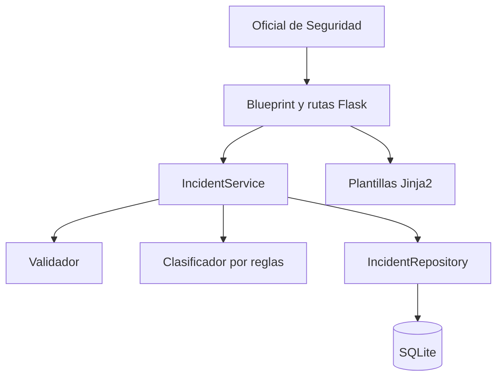

# SIGI-AI

**Sistema Inteligente de Gestión de Incidentes**

Aplicación web académica desarrollada con Flask para registrar, clasificar y consultar incidentes tecnológicos, de seguridad de la información y de seguridad física.

## Descripción del problema

En una organización, los incidentes pueden registrarse de manera dispersa, lo que dificulta su clasificación, priorización, consulta y seguimiento.

SIGI-AI centraliza esta información y utiliza un sistema experto basado en reglas y palabras clave para asignar automáticamente una categoría, una prioridad y una explicación comprensible a cada incidente.

## Objetivo

Desarrollar un producto mínimo viable (MVP) que permita:

1. Registrar incidentes de manera estructurada.
2. Clasificarlos automáticamente mediante reglas explicables.
3. Consultarlos y filtrarlos por categoría y prioridad.

## Alcance del MVP

| Requisito | Descripción |
|---|---|
| Registrar incidente | Registra título, descripción, ubicación u origen y fecha del incidente. |
| Clasificar incidente | Asigna categoría, prioridad y explicación mediante reglas y palabras clave. |
| Consultar incidentes | Muestra los registros y permite filtrarlos por categoría y prioridad. |

El MVP no incluye autenticación, edición, eliminación, notificaciones, panel estadístico ni servicios externos.

## Categorías

- Seguridad de la Información
- Seguridad Física
- Hardware
- Software
- Red/Conectividad
- Cuenta/Usuario
- Por revisar

## Prioridades

| Prioridad | Interpretación |
|---|---|
| Alta | Incidente de impacto elevado o relacionado con riesgos importantes. |
| Media | Incidente que requiere atención y revisión. |
| Baja | Incidente de impacto reducido o sin coincidencias críticas. |

## Arquitectura

SIGI-AI utiliza un monolito modular organizado en capas.



### Responsabilidades

| Componente | Responsabilidad |
|---|---|
| Rutas y Blueprint | Recibir solicitudes HTTP y renderizar respuestas. |
| Servicio | Coordinar validación, clasificación y persistencia. |
| Validador | Verificar campos obligatorios y formato de fecha. |
| Clasificador | Determinar categoría, prioridad y explicación. |
| Repositorio | Encapsular el acceso parametrizado a SQLite. |
| Plantillas | Presentar formularios, resultados y mensajes en español. |

## Tecnologías utilizadas

- Python 3.13
- Flask 3.1.1
- SQLite
- Jinja2
- HTML5
- CSS3
- Pytest 8.3.5
- Git y GitHub
- Kiro

## Organización del proyecto

| Ruta | Contenido |
|---|---|
| `app/blueprints/` | Rutas HTTP de la aplicación. |
| `app/classifier/` | Sistema experto basado en reglas. |
| `app/repositories/` | Acceso a la base de datos. |
| `app/services/` | Lógica de aplicación. |
| `app/validators/` | Validación de los incidentes. |
| `app/templates/` | Plantillas HTML con Jinja2. |
| `app/static/` | Estilos CSS. |
| `tests/unit/` | Pruebas unitarias. |
| `tests/integration/` | Pruebas de integración. |
| `.kiro/specs/sigi-ai/` | Requirements, Design y Tasks. |

## Instalación en Windows

### 1. Clonar el repositorio

```powershell
git clone https://github.com/GabryelT/SIGI-AI.git
cd SIGI-AI
```

### 2. Crear el entorno virtual

```powershell
python -m venv .venv
```

### 3. Activar el entorno

```powershell
.venv\Scripts\Activate.ps1
```

### 4. Instalar dependencias

```powershell
python -m pip install -r requirements.txt
```

### 5. Configurar la clave secreta

```powershell
$env:SECRET_KEY="cambiar-por-una-clave-segura"
```

### 6. Iniciar la aplicación

```powershell
python run.py
```

Abrir en el navegador:

```text
http://127.0.0.1:5000
```

La base de datos SQLite y su tabla se crean automáticamente al iniciar la aplicación.

## Uso

### Registrar un incidente

1. Seleccionar **Registrar incidente**.
2. Completar los cuatro campos obligatorios.
3. Presionar **Registrar incidente**.
4. El sistema valida, clasifica y almacena el incidente.
5. Se muestra el identificador generado.

### Consultar incidentes

1. Seleccionar **Consultar incidentes**.
2. Revisar el listado ordenado desde el registro más reciente.
3. Aplicar filtros por categoría, prioridad o ambos.
4. Utilizar **Limpiar filtros** para volver al listado completo.

## Pruebas

Ejecutar toda la suite desde la raíz:

```powershell
python -m pytest tests -q
```

Resultado verificado:

```text
202 passed
0 failed
```

Las pruebas cubren:

- Validación de campos obligatorios.
- Validación estricta de fechas `AAAA-MM-DD`.
- Categorías y prioridades.
- Palabras con mayúsculas y tildes.
- Empates y ausencia de coincidencias.
- Manejo de errores internos.
- Persistencia con SQLite temporal.
- Servicio de aplicación.
- Registro, consulta, filtros y rutas HTTP.
- Renderizado seguro de plantillas.

## Seguridad y buenas prácticas

- Sentencias SQL parametrizadas.
- Separación de responsabilidades por capas.
- Validación centralizada de entradas.
- Lista blanca de campos permitidos.
- Autoescape de Jinja2 conservado.
- No se utiliza el filtro `|safe`.
- `DEBUG` desactivado por defecto.
- `SECRET_KEY` obtenida desde una variable de entorno.
- Páginas de error 404 y 500 sin información técnica.
- Base de datos local excluida mediante `.gitignore`.
- Pruebas aisladas con bases de datos temporales.

## Desarrollo guiado por especificaciones con Kiro

El proyecto fue organizado mediante los artefactos:

- [Requirements](.kiro/specs/sigi-ai/requirements.md)
- [Design](.kiro/specs/sigi-ai/design.md)
- [Tasks](.kiro/specs/sigi-ai/tasks.md)

Estos documentos definen los requisitos funcionales, criterios de aceptación, arquitectura, componentes y tareas de implementación.

## Flujo de trabajo Git

El desarrollo se realizó mediante ramas independientes y Pull Requests.

| Rama | Propósito |
|---|---|
| `chore/project-foundation` | Estructura Flask y especificaciones de Kiro. |
| `feature/rule-classifier` | Clasificador automático basado en reglas. |
| `feature/incident-registration` | Registro, validación y persistencia. |
| `feature/incident-list` | Consulta y filtros. |
| `test/software-tests` | Pruebas unitarias y de integración. |
| `feature/ui-and-security` | Interfaz responsiva y seguridad. |
| `docs/readme` | Documentación final. |

Se aplicaron commits descriptivos y Pull Requests para conservar evidencia del proceso colaborativo.

## Autor

**GabryelT**

Proyecto académico de Desarrollo de Software Inteligente: Aplicaciones con IA para Negocios Digitales.